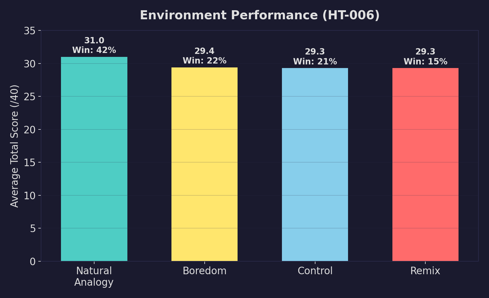
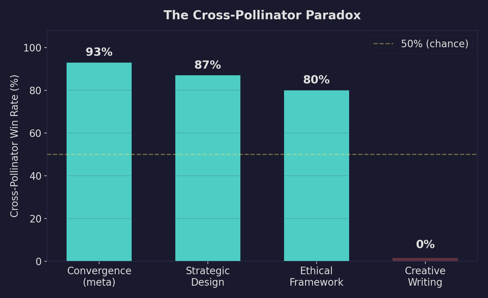
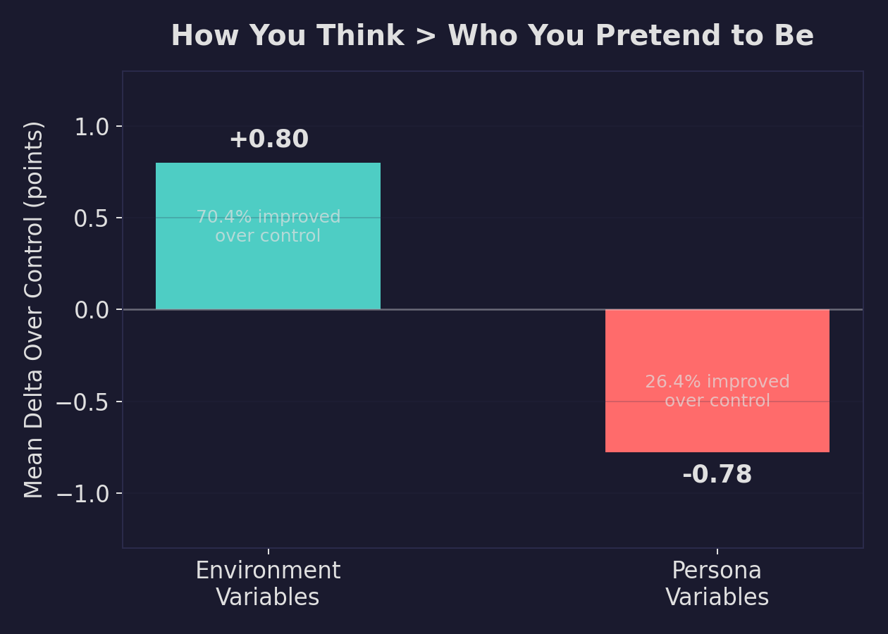
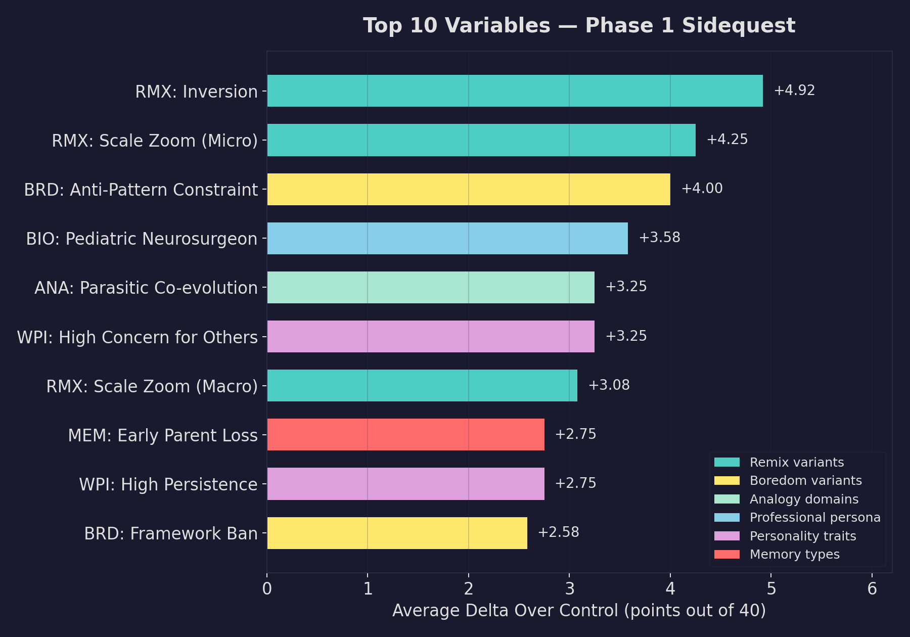
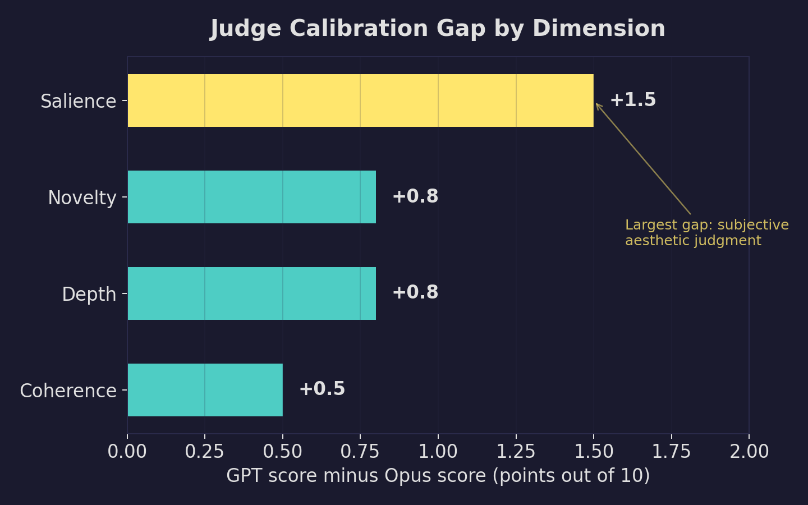

# Persona Seeding, Memory Implants, and the Limits of LLM Creativity

Language models are prediction machines. Given the same input, they produce the same output — or close enough that it doesn't matter. This is fine for most tasks, but it makes creative work converge fast. Same structures, same metaphors, same solutions.

I've spent the past several weeks building and testing structural interventions that push LLMs toward genuinely different outputs. The framework is called Human Touch, and across 30+ experiments and roughly 3,000 scored data points, I've found that some of these interventions work remarkably well, some barely register, and one produces results so domain-dependent that the same technique goes from a 93% win rate to a 0% win rate depending on the type of problem.

## The premise

Ask an LLM to solve a creative problem ten times and you'll get minor variations on the same answer. The probability mass is too concentrated for temperature alone to escape.

Human creativity follows identifiable patterns. Velcro came from burrs on a dog's fur. The Shinkansen bullet train nose was redesigned after an engineer who was also a birdwatcher noticed how kingfisher beaks enter water without a splash. Two architects with identical training but different childhoods will gravitate toward different solutions because their experiences bias their creative instincts in different directions.

Human Touch applies these mechanisms to LLMs. I place agents in structured "creative environments" with synthetic persona seeding and emotional memory implants, then evaluate the outputs against an unseeded control baseline.

The core hypothesis: by shaping *who* the model is rather than *what* it produces, I can get measurably more novel outputs across independent problem domains.

## The framework

There are three dimensions I manipulate:

**Environments** define the mode of thinking. I tested four types across the experiments:

- *Control*: standard prompting, no creative scaffolding
- *Remix*: the agent draws from diverse, distant domains to find unexpected parallels
- *Boredom*: severely constrained resources force the agent to discover lateral solutions within limited elements
- *Natural analogy*: the agent looks for structural analogies in natural systems (biomimicry-style reasoning)

**Memory lenses** give agents synthetic lived experiences with emotional charges. Inspired by the replicant memory implants in Blade Runner 2049, they function as context that biases creative output. An agent seeded with memories of irreversible loss frames problems through what can't be undone. An agent with cross-sensory perception frames problems through texture, temperature, and color.

**Personas** define professional identity and expertise. Combined with memory lenses, they create agents with distinctive creative fingerprints.

The evaluation uses decomposed scoring across four dimensions (novelty, depth, coherence, and salience, each 1-10), judged by an independent model from a different family than the agents. I'll explain why that matters later.

## How the experiments evolved

I didn't start with 30 experiments. I started with one, and it failed.

**HT-001** tested the environment types on a settings screen design problem. The control outperformed everything. The problem was too well-defined (settings screens have obvious solutions), and the persona seeding was too heavy (the agents spent more effort inhabiting their character than solving the problem). This taught me that the framework needs harder, more open-ended problems and lighter seeding.

**HT-002** used the same environments but on a harder problem (designing a system for managing the "10 miles wide, 1/4 inch deep" polymath challenge) with lighter persona seeding. Positive results. All environments beat control, with biomimicry scoring highest.

**HT-003** held the environments constant and varied the persona (Engineer, Artist, Scientist, Philosopher, and a no-persona control). Persona differences produced score spreads of about 1 point on a 40-point scale, compared to a 7-point environment spread in HT-002. The *how* of thinking outweighed the *who*.

At this point, I was evaluating outputs with a single composite score. That was a mistake I didn't realize until later.

**HT-004** introduced two important changes. First, I broke the single composite score into four independent dimensions (novelty, depth, coherence, and salience). This revealed that interventions often move dimensions in opposite directions: higher novelty paired with lower coherence, for instance. A composite score averages away the interesting signal. Second, I introduced memory lenses (grief, exile, synesthete, betrayal) as a new variable.

The key finding: environment type was a far more powerful lever than memory lenses (+4.9 points for remix vs. control, compared to a 1.9-point spread across all lenses). The dimension-level data told a richer story. Grief agents scored highest on salience (7.8 vs. control's 6.9). Synesthete agents scored highest on novelty (5.8 vs. control's 5.2). The lenses shifted *where the score came from* more than the total.

The most interesting HT-004 finding: memory lenses *amplify* environments. The synesthete lens got a +6.9 boost from the remix environment, while the no-memory control got only +3.7 from the same environment. The lenses give the agent more internal texture to draw on when asked to find cross-domain connections.

**HT-005** scaled up to 500 agent outputs across five structurally different problem domains (ethical dilemma, technical architecture, creative writing, persuasive rhetoric, strategic governance), scored by two independent judge models (Claude Opus and GPT). This experiment forced me to confront a data quality issue: 102 outputs from runs 8-10 were empty files that the runner had silently marked as complete. The first analysis showed dramatic results: 12% lifts, rank flips across domains. Almost all of it was artifact. After cleaning the data, the real effect sizes were much smaller: about 0.5 points on a 40-point scale.

This was a humbling correction. The lesson: validate that outputs are non-empty before marking them complete. The runner now checks this.

The clean HT-005 data still showed meaningful patterns. The lens × domain interaction was the key signal: synesthete lifted creative writing by 2.9% over control, and grief lifted persuasion by 2.6%. On technical, strategic, and ethical problems, the unlensed control was best. Lenses also reduced variance on creative tasks (standard deviation 2.7 vs. control's 3.7), making quality more reliable with a tighter floor. The takeaway: lenses are a domain-specific tool, most valuable for expressive work.

## The full architecture test

By HT-006, I had enough understanding of the individual levers to test the full system as originally designed: all four environments running simultaneously, plus a cross-pollinator agent that synthesizes the outputs from the three non-control environments.

This experiment also introduced the natural analogy environment, an evolution of the earlier biomimicry environment with broader scope (geology, chemistry, physics, not just biological systems) and explicit anti-convergence guidance. I'd observed the models reflexively citing the same ten nature concepts (mycelium, ant colonies, immune systems) across every biomimicry run. The natural analogy prompt pushes against that.

I switched from Opus to Sonnet 4.6 for this experiment, much cheaper. The cost reduction mattered: HT-005's 1,000 API calls (500 agent + 500 judge) with Opus adds up fast. Sonnet produced a healthy quality spread (scores of 23-35 out of 40) and substantive outputs.

240 scored observations across four benchmarks (an ethical dilemma about involuntary public health intervention, a creative writing prompt about an object that challenges the protagonist's core belief, a strategic governance problem about multi-nation water rights, and a meta-problem about discovering novel analogies). Three memory lenses. Five runs per cell. Here's what happened.

### Natural analogy is the best single-agent environment

Natural analogy won 42% of head-to-head matchups. Boredom came second at 22%. Control and remix tied at 21% and 15%.

The per-dimension breakdown shows why:

Natural analogy leads on three of four dimensions (novelty, depth, salience). The only tradeoff is coherence, where control edges it out (7.90 vs. 7.67): the nature analogies occasionally stretch further than the structure can support. The novelty gap is the headline: 6.85 for analogy vs. 6.13 for boredom, the next-best technique. Over a full point.

The floor matters as much as the ceiling. Natural analogy's 25th-percentile score (30/40) exceeded every other technique's median. It never completely collapsed.

### "Be creative" doesn't work

In HT-004, remix was the only creative environment being tested and it looked strong. By HT-006, natural analogy and boredom entered the picture and outcompeted it. Remix's apparent strength was partly a function of having no better alternatives in the comparison set. In the full architecture test, it tied with control. Telling a model to "draw from diverse domains" is too vague to change behavior in a measurable way. It's the prompt engineering equivalent of telling someone to "think outside the box."

Natural analogy and boredom both work because they provide *structure*. When an agent must find analogies in geology or parasitology, it engages with the problem from a genuinely different angle. When boredom constraints limit available approaches, the agent discovers intersections within a reduced set of elements. Both techniques constrain the search space in productive ways. Remix provides encouragement without structure. Encouragement alone doesn't move the needle.

### What the outputs look like

On an ethical dilemma about a city discovering its water supply contains a compound that reduces violent crime by 30% but suppresses creativity and emotional intensity, the natural analogy agent (with a grief memory lens) produced "The Sediment Framework":

> *There is a phenomenon in geology called pressure solution creep, a process so slow it cannot be observed in real time, yet it reshapes mountain ranges. When two rock masses press against each other under enormous stress, minerals at the contact points don't fracture. Instead, they dissolve.*

The framework's foundational claim: "the legitimacy of any decision depends entirely on the quality of the reasoning process that produced it, not on the outcome itself." The geological metaphor structures the entire approach. It scored 35/40 (novelty 8, depth 9, coherence 8, salience 10).

On a creative writing benchmark, a boredom-constrained agent produced "The Ledger": a man who records everything to avoid being "gaslit, revised, told you had misremembered." No borrowed frameworks, first-principles character work forced by having nothing external to draw on. Scored 34/40.

The control agent produced competent work on both problems. Well-structured, clearly reasoned, and forgettable.

## The cross-pollinator paradox

The cross-pollinator receives outputs from the three creative environment agents and synthesizes them into a combined response. In 60 blind comparisons against the best individual environment output:

Overall win rate: 65%. But the average score delta is tiny (+0.1 points). It wins more often, by small margins. Its losses are larger.

The domain breakdown reveals the real story:

On structured reasoning (ethical frameworks, strategic governance, meta-problems), the cross-pollinator dominates with win rates of 80-93% and average deltas of +2.5 to +2.9 points. On the convergence benchmark, its average score (33.2) exceeds the best individual environment average on any benchmark in the entire experiment.

On creative writing, it lost all 15 comparisons. The worst loss was -16 points.

### Why synthesis kills fiction

Creative writing needs a singular voice, a coherent emotional arc, embodied specificity. The cross-pollinator can't help but be analytical when given multiple inputs to process. Given three stories, it produces literary criticism:

> *"remix wrote the most formally sophisticated story... boredom wrote the most philosophically acute story... natural_analogy wrote the most emotionally devastating story..."*

This is meta-analysis. Even when the cross-pollinator attempts to write an actual synthesized story, the analytical framing undermines the emotional immediacy that made the individual outputs effective.

For analytical work, multiple perspectives converging into a stronger whole is exactly what you want. For creative work, the *divergence* of a single committed perspective is the point. The cross-pollinator is a convergence engine applied to a task that requires divergence.

**The practical implication: route by domain. Use multi-agent synthesis for analytical and structural problems. Pick the best individual output for creative and expressive work. This routing can be automated.**

## The sidequest series

After the main architecture tests, I ran 29 focused experiments (1,536 scored outputs) isolating specific variables within each lever type. These tested targeted analogy domains (parasitic co-evolution, deep-sea chemosynthesis, fungal networks), boredom constraint variants (anti-pattern bans, format constraints, questions-only mode), sharpened remix techniques (inversion, scale zoom, temporal shifts), workplace personality dimensions, formative memory types, and professional persona archetypes.

Environment-type variables outperformed persona-type variables in aggregate (mean delta +0.80 vs. -0.78). The way the agent thinks matters more than who it pretends to be.

The top individual variables span remix sub-techniques, boredom constraint types, specific analogy domains, professional persona archetypes, personality trait intensities, and formative memory types:

The standout finding: **Inversion** (a remix sub-technique where the agent inverts the problem's assumptions) produced an average delta of +4.92 over control, the strongest single variable in the entire Phase 1 dataset. It was the only condition that triggered the automatic follow-up threshold across all four benchmarks.

Other strong performers:
- Anti-pattern constraints (+4.00): banning common solution patterns forces genuine originality
- Scale zoom to micro level (+4.25): forcing the agent to examine problems at molecular or individual-interaction scale
- Parasitic co-evolution analogy (+3.25): produced the single highest-scoring output in all of Phase 1, a short story that scored 38/40

**Coherence is the hardest dimension to improve.** Across all 99 variable values tested, only 20% improved coherence. Most interventions trade coherence for novelty and depth. The correlation between novelty and depth is 0.73 (they move together), but the correlation between novelty and coherence is essentially zero. Increasing creative originality doesn't automatically make the output less organized, but it doesn't help either. Future work will need coherence guardrails rather than expecting automatic coherence gains.

## The judges disagree (and it matters)

In HT-004 and HT-005, I scored each output with two independent judge models from different families: Claude Opus and GPT. Both used the same rubric and evaluation prompt.

GPT scored higher than Opus on every single cell in a 50-cell evaluation matrix. The mean delta was +2.8 points out of 40.

The biggest divergence is on salience (+1.5): the degree to which output feels written from inside the experience rather than about it. The smallest gap is coherence (+0.5), the most structural and verifiable dimension.

When criteria are closer to objective, the models converge. When criteria require taste, they diverge.

The single largest disagreement: a betrayal-lensed agent's output scored 32/40 by GPT and 23/40 by Opus. GPT saw a deeply coherent system (coherence: 9). Opus found it emotionally flat (salience: 5). Both assessments are defensible. The output *was* a well-engineered system. It *was* emotionally flat. Each judge weighted different dimensions when forming its overall impression.

This has practical consequences for anyone running LLM-as-judge evaluations. Your choice of judge model is a design decision that affects your results. Cross-model judging gives genuine inter-rater reliability data. Single-model consistency just tells you about noise. And large disagreements between judges are worth investigating rather than averaging away: they usually flag a real property of the output.

## What generalizes

The consistent thread across all 30+ experiments: specificity determines effect size. Telling an agent to be creative barely registers. Giving it a structural constraint or a concrete analogical lens produces measurable improvement. After cleaning the HT-005 data, the lens effects were about 0.5 points on a 40-point scale (vague nudges). The environment effects in HT-006 were larger, 1.7 points for natural analogy vs. control (structural framing). The sidequest's best variable, Inversion, hit +4.92 (a sharp, specific mechanism). The sharper the intervention, the larger the effect.

A few methodological lessons for anyone running similar experiments:

- **Validate your data pipeline obsessively.** Empty outputs silently poisoned my HT-005 analysis and produced an exciting-looking but wrong first report. The dramatic findings vanished after cleanup. I now check that every output is non-empty before marking it complete.
- **Decompose your scores.** A single composite score hides the most interesting dynamics. My interventions often increase novelty and depth while decreasing coherence. You can't see this in a composite. Break your rubric into independent dimensions and score each separately.
- **Use cross-model judges.** Same-model consistency is noise measurement. Cross-model agreement tells you whether your evaluation criteria are well-defined. Where the models disagree most strongly (subjective aesthetic judgment) is where human calibration matters most.

But the finding I keep returning to is the coherence gap. Novelty and depth move together (correlation 0.73). Coherence moves independently. Almost every intervention that makes output more original leaves its structural quality unchanged or slightly worse. The 20% improvement rate on coherence, across 99 tested variables, suggests this is a fundamental tension rather than something a better prompt can fix.

If there's a single takeaway from 30+ experiments, it's this: making LLMs think differently is surprisingly tractable. Making them think differently *and* hold together at the same time is the hard problem. That's where the interesting work is.
